# AML Agent — AI-Powered Suspicious Activity Detection

An autonomous, query-aware AML (Anti-Money Laundering) compliance agent. Instead of running a fixed sequential pipeline, this system uses an LLM-based planner to decide *which* tools to invoke, in *what order*, on *which subset* of data — based on the natural-language query it receives. Every planning decision, skip reason, and risk score is visible and traceable.

---

## Features

- **Natural language query interface** — ask the agent anything about your transaction data
- **Dynamic execution planning** — the agent builds a custom tool execution plan per query; it never runs a fixed pipeline
- **Visible reasoning** — the plan, including which tools were skipped and why, is shown live
- **AML pattern detection** — structuring, smurfing, layering, rapid cash-out
- **Risk scoring** — Low / Medium / High classification with contributing features per entity
- **LLM-generated explanations** — plain-language summaries tied to query intent
- **Deterministic escalation policy** — Monitor / Flag for review / Report (SAR draft)
- **Live animated plan visualizer** — tool cards animate in execution order; skipped tools appear greyed with visible reason
- **Results dashboard** — KPI tiles, flagged entity table, amount histogram, activity timeline
- **Entity deep-dive drawer** — per-customer risk gauge, feature contribution bars, explanation panel
- **Raw JSON inspector** — full `ExecutionReport` payload viewable at any time
- **Entity risk network** — D3 force-directed graph of flagged customers, clustered by AML pattern
- **Offline resilience** — falls back to mocked data if backend is unreachable
- **Accessibility** — keyboard navigable, WCAG AA contrast, reduced-motion support, screen reader labels

---

## Screenshots

---

### 1 · Query Console
> *Ask the agent anything. Quick-select chips load the three reference investigation types in one click.*

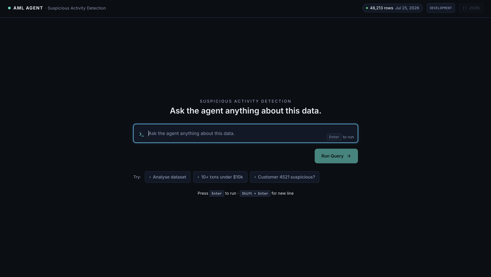

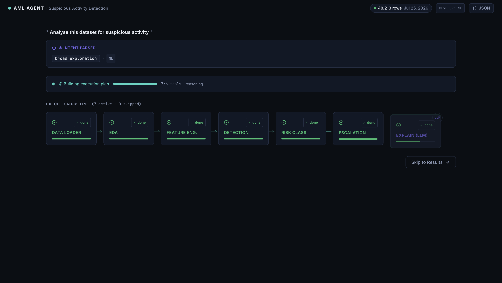

---

### 2 · Live Plan Visualizer — The Key Screen
> *The agent's decision made visible. Tool cards animate in execution order. Skipped tools appear greyed with the reason shown — no hover required.*

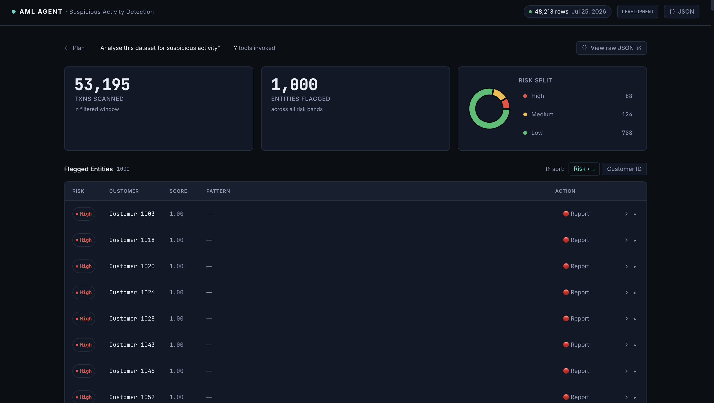

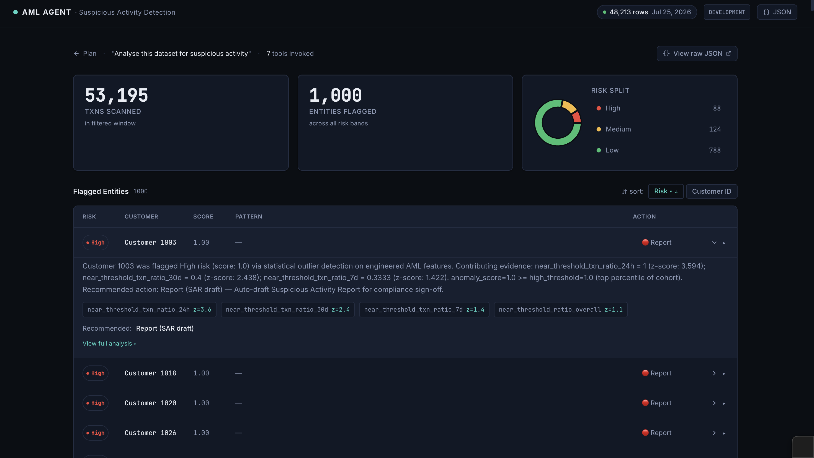

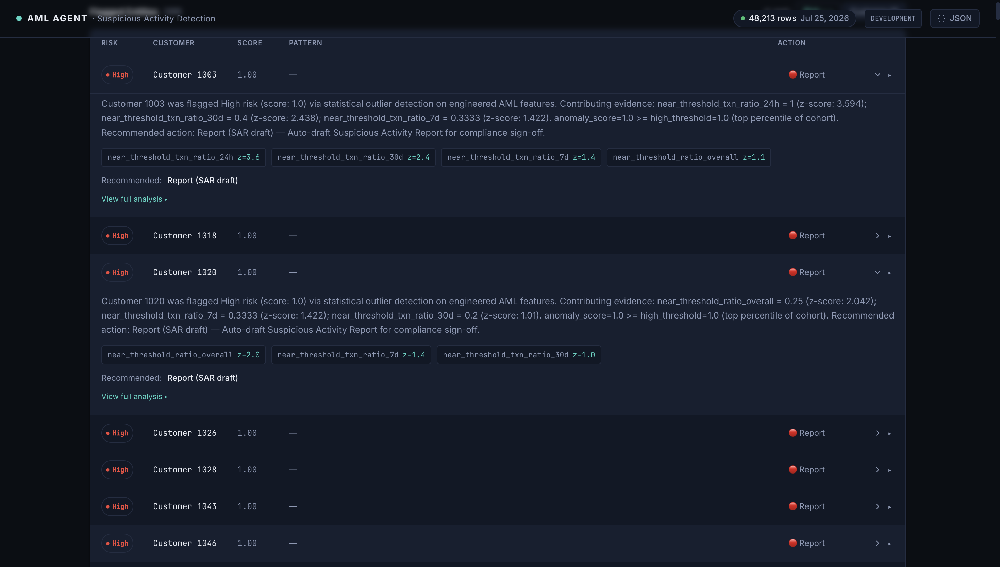

---

### 3 · Results Dashboard
> *KPI tiles count up from 0 on entry. Risk donut filters the entity table on click. Every number traces back to the raw JSON.*

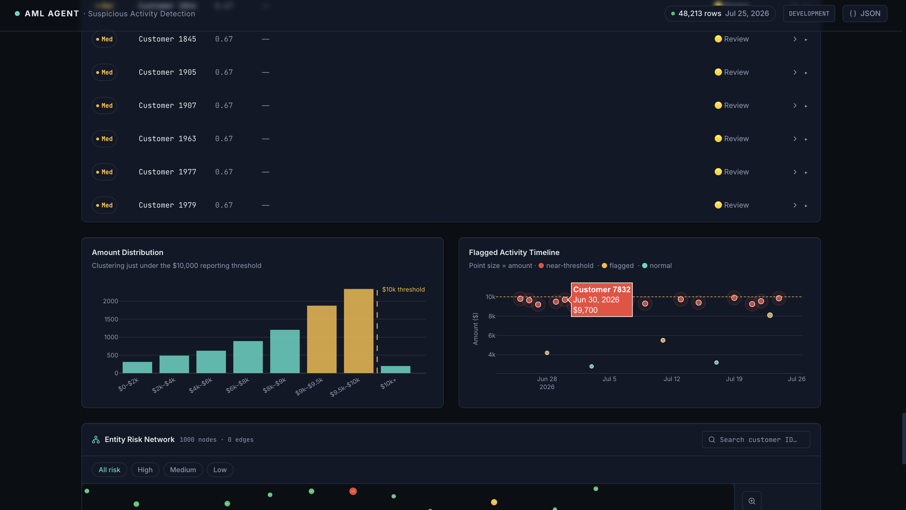

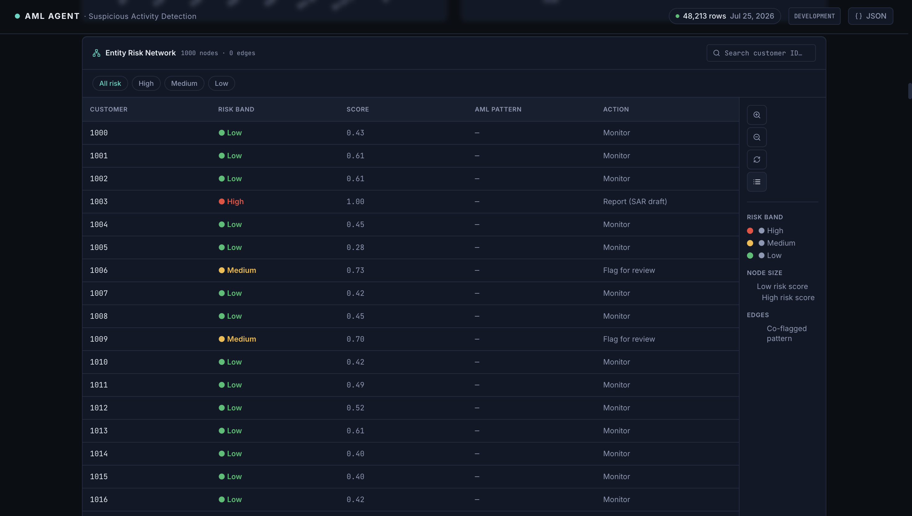

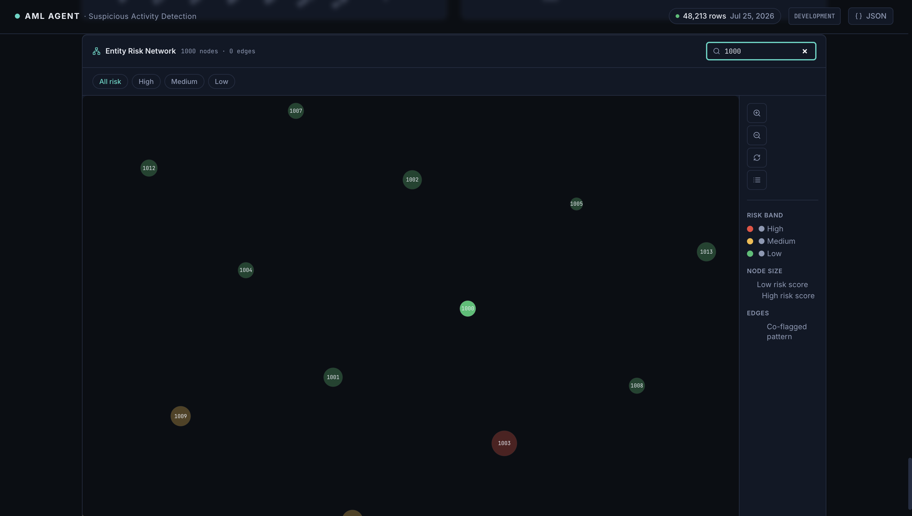

---

### 4 · Raw JSON Inspector
> *The complete `ExecutionReport` — plan, skip reasons, scores, features — always one click away from anywhere in the app.*

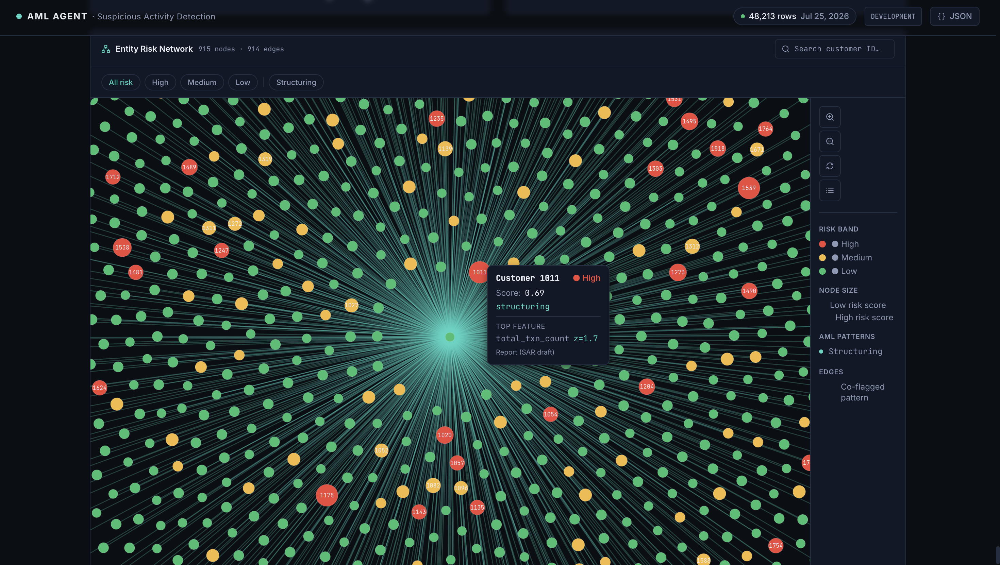

---

### 5 · Entity Risk Network
> *D3 force-directed graph. Nodes sized by risk score, coloured by risk band, clustered by AML pattern.*

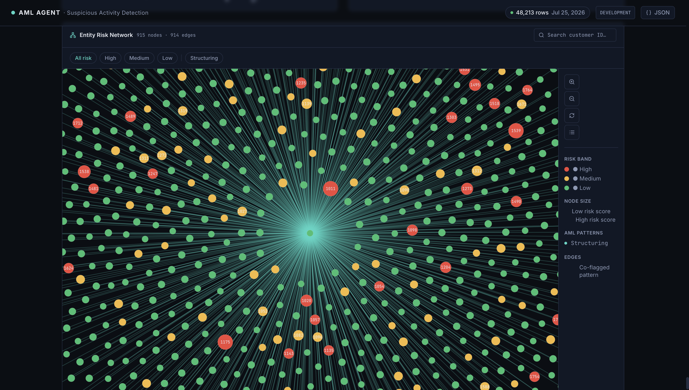

---

### 6 · Entity Deep-Dive Drawer
> *Click any flagged entity. SVG risk gauge sweeps to the score. Feature contribution bars animate in. Plain-English explanation with the numbers underlined.*

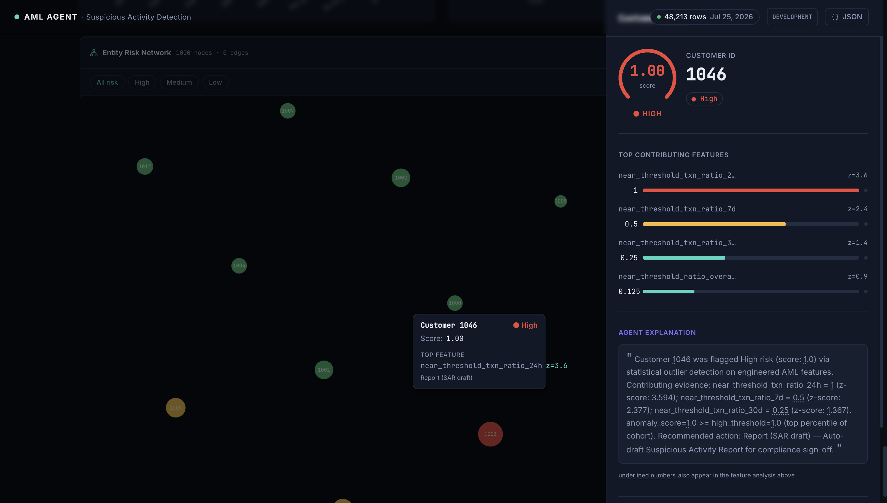

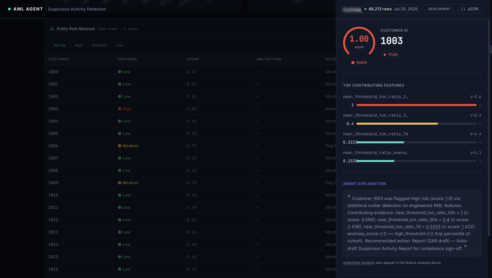

---

### 7 · Raw JSON Inspector
> *The complete `ExecutionReport` — plan, skip reasons, scores, features — always one click away from anywhere in the app.*

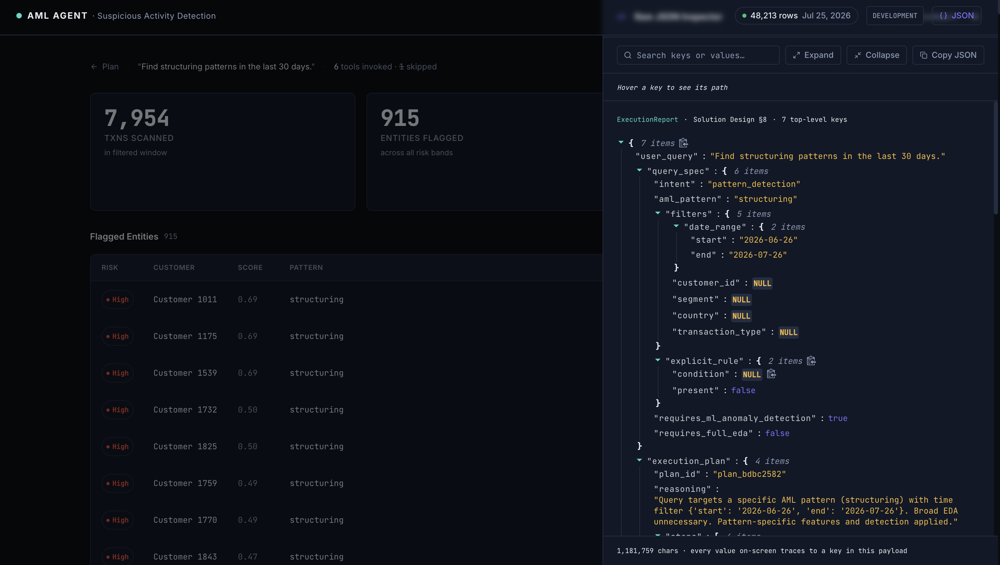

---

## Tech Stack

### Backend

| Layer | Technology |
|---|---|
| Language | Python 3.11+ |
| API framework | FastAPI |
| Schema validation | Pydantic v2 |
| LLM (optional) | Anthropic Claude (`claude-sonnet-4-20250514`) |
| Data handling | pandas |
| ML / anomaly detection | scikit-learn, scipy |
| Graph features | networkx |
| Config | PyYAML, python-dotenv |
| Testing | pytest |

### Frontend

| Layer | Technology |
|---|---|
| Framework | React 19 + TypeScript ~6.0 |
| Build tool | Vite 8 |
| Styling | Tailwind CSS 3 + CSS custom properties |
| Animation | Framer Motion 11 |
| State management | Zustand 4 |
| Charts | Recharts 2 (donut/bars) + Plotly.js 2 (histogram/scatter) |
| Network graph | D3 (force, drag, zoom, selection) |
| JSON inspector | react-json-view |
| Icons | lucide-react |

---

## Prerequisites

- **Python** 3.11 or higher
- **Node.js** 20 or higher + npm 10+
- **Anthropic API key** (optional — system runs in deterministic stub mode without it)

---

## Installation

### Backend

```bash
# Clone and enter the project root
cd hackathon_project

# Install Python dependencies
pip install -r requirements.txt

# Copy environment file
cp .env.example .env

# Edit .env — set your Anthropic API key if you have one (optional)
# ANTHROPIC_API_KEY=sk-ant-...
```

### Frontend

```bash
cd frontend

# Install Node dependencies
npm install

# Copy environment file
cp .env.example .env
# Default values are correct for local development
```

---

## Environment Variables

### Backend (`.env` in project root)

| Variable | Default | Description |
|---|---|---|
| `ANTHROPIC_API_KEY` | _(empty)_ | Anthropic Claude API key. Leave blank to use the deterministic planner. |
| `MODEL_NAME` | `claude-sonnet-4-20250514` | Claude model identifier for planning and explanation calls. |
| `STUB_MODE` | `true` | Set `true` to use stub tools that return hard-coded JSON (no real data processing). |
| `DATA_DIR` | `data/synthetic` | Path to the directory containing `transactions.csv` and `customers.csv`. |
| `LOG_LEVEL` | `INFO` | Python logging level. |

### Frontend (`frontend/.env`)

| Variable | Default | Description |
|---|---|---|
| `VITE_API_BASE_URL` | `http://localhost:8000` | Base URL for the FastAPI backend. |
| `VITE_APP_TITLE` | `AML Agent · Suspicious Activity Detection` | Browser tab title. |
| `VITE_ENV` | `development` | Environment label shown in the top bar. |

---

## Running the Application

### Start the Backend

```bash
# From the project root

# Option 1: Using Make (stub mode, no LLM)
make dev

# Option 2: Direct — stub mode
STUB_MODE=true python -m src.main

# Option 3: With LLM (requires ANTHROPIC_API_KEY in .env)
STUB_MODE=false uvicorn src.api.main:app --host 0.0.0.0 --port 8000 --reload
```

The API will be available at `http://localhost:8000`.  
Interactive API docs: `http://localhost:8000/docs`

### Start the Frontend

```bash
cd frontend
npm run dev
```

The application will be available at `http://localhost:5173`.

---

## Running Tests

```bash
# From the project root
make test

# Or directly
pytest tests/ -v

# Run a specific test file
pytest tests/unit/test_data_loader.py -v
```

Test categories:
- `tests/unit/` — individual tool functions
- `tests/integration/` — full pipeline with synthetic data
- `tests/e2e/` — end-to-end query execution

---

## Build Commands

### Backend

The backend runs directly from source — no build step required.

```bash
# Install for production
pip install -r requirements.txt

# Run with uvicorn
uvicorn src.api.main:app --host 0.0.0.0 --port 8000
```

### Frontend Production Build

```bash
cd frontend
npm run build
# Output: frontend/dist/
```

```bash
# Preview the production build locally
npm run preview
```

---

## Project Structure

```
hackathon_project/
├── .env.example                 # Backend environment variable template
├── Makefile                     # Convenience commands (install, dev, test)
├── requirements.txt             # Python dependencies
├── README.md
│
├── data/
│   └── synthetic/
│       ├── customers.csv        # Synthetic customer data
│       └── transactions.csv     # Synthetic transaction data
│
├── docs/
│   ├── AML_Agent_Frontend_Design.md
│   ├── AML_Agent_Solution_Design.md
│   └── AML_Agent_Implementation_Plan.md
│
├── src/
│   ├── main.py                  # Backend entry point
│   ├── agent/
│   │   ├── controller.py        # AgentController — orchestration loop
│   │   └── planner.py           # DeterministicPlanner + PlanValidator
│   ├── api/
│   │   └── main.py              # FastAPI app, /query and /health endpoints
│   ├── config/
│   │   ├── settings.py          # Settings dataclass (reads from env)
│   │   ├── api_config.yaml      # API host/port/CORS/limits
│   │   └── *.yaml               # Per-tool configuration files
│   ├── schemas/
│   │   ├── execution_plan.py    # ExecutionPlan Pydantic model
│   │   ├── execution_report.py  # ExecutionReport Pydantic model
│   │   └── query_spec.py        # QuerySpec Pydantic model
│   └── tools/
│       ├── registry.py          # ToolRegistry (name → callable)
│       ├── data_loader.py
│       ├── eda_tool.py
│       ├── feature_engineering.py
│       ├── anomaly_detection.py
│       ├── risk_classification.py
│       ├── escalation.py
│       └── explanation.py
│
├── tests/
│   ├── unit/                    # Per-tool unit tests
│   ├── integration/             # Full pipeline tests
│   └── e2e/                     # End-to-end tests
│
└── frontend/
    ├── .env.example             # Frontend environment variable template
    ├── package.json
    ├── vite.config.ts
    ├── tailwind.config.js
    └── src/
        ├── App.tsx              # Root component, SPA state router
        ├── main.tsx             # React entry point
        ├── animations/          # Framer Motion variants
        ├── components/
        │   ├── aml/             # AML-specific components (ToolCard, RiskBadge, etc.)
        │   ├── shared/          # TopBar, ToastContainer
        │   └── ui/              # Generic UI primitives (Button, Drawer, etc.)
        ├── config/              # env.ts — typed environment config
        ├── constants/           # App-wide constants and motion tokens
        ├── features/
        │   ├── query/           # Screen ①: Query Console
        │   ├── plan/            # Screen ②: Plan Visualizer
        │   ├── results/         # Screen ③: Results Dashboard
        │   ├── drawer/          # Screen ④: Entity Deep-Dive Drawer
        │   ├── inspector/       # Screen ⑥: Raw JSON Inspector
        │   └── network/         # Entity Risk Network visualization
        ├── hooks/               # useQuery, useCountUp, useTypewriter, useReducedMotion
        ├── layouts/             # AppShell layout
        ├── services/api/        # REST client + synthetic SSE service
        ├── stores/              # Zustand stores (query, planner, report, ui, dataset)
        ├── styles/              # tokens.css (design tokens), globals.css
        ├── types/               # TypeScript type definitions
        └── utils/               # cn, format, risk utilities
```
